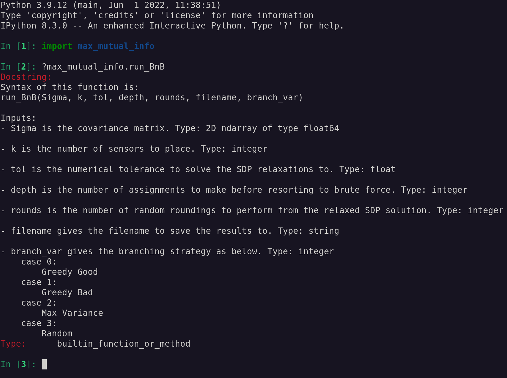
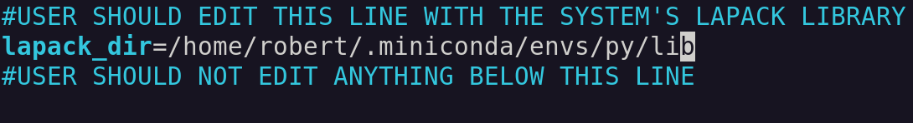

# Sensor Placements which Maximize Mutual Information

This repository implements a branch and bound algorithm to place $k$ sensors from $n$ candidate locations. The resulting placement maximizes the mutual information between locations where sensors are placed and those where no sensors are placed. We've provided a convenient Python interface, which passes user input to the branch and bound algorithm written in a mixture of C, C++, and Fortran. 

The branch and bound algorithm uses a novel semidefinite relaxation of the mutual information subproblems to determine upper bounds. Details of this relaxation will be provided in the MS thesis of LT Erik Vargas as well as the preprint *Optimal Sensor Placement Using Mutual Information: Certifiable Optimality via Semidefinite Relaxation*, both of which are in draft. 

We rely on the open source [SCS solver of O'Donoghue et al](https://github.com/cvxgrp/scs) for solving the semidefinite relaxations, so we thank that team for their high quality solver.

## Usage

The branch and bound solver takes as input an $n$ by $n$ covariance matrix $\Sigma$, such that the $\Sigma_{i,j}$ gives the covariance of the signals received at candidate locations $i$ and $j$. The user should also specify $k$, the number of sensors to be placed. Additional arguments specify the ...

After installation (see directions below), the Python package can be imported with `import max_mutual_info`. To call branch and bound algorithm, use the function `max_mutual_info.run_BnB`. Detailed information on this functions syntax can be found in its documentation string.



## Build & Installation

The build & installation directions below are for Linux systems only.

### Before you start

Make sure you have the following installed on your system: gfortran, gcc, g++, GNU Make, LAPACK, Python3, pip, and the numpy and cython packages within Python.

If you are using anaconda, you can install all these dependencies with the following command.

```conda install -c conda-forge compilers lapack make numpy cython```

### Install Directions

1. Clone this git repository.

```git clone https://github.com/rbassett3/mutual_info_sensor_placement.git```

2. Using your text editor of choice, modify `build_and_install.sh`. Change the `lapack_dir` directory in that file to point to the directory containing your LAPACK library.



3. Build and install the package by running the script.

```source build_and_install.sh```

4. (Optional). Verify that the install completed successfully by navigating to src/tests folder and running `python tests.py`.

## License

All code in this repository is licensed CC0.

To the extent possible under law, the persons who associated CC0 with this work has waived all copyright and related or neighboring rights to this work. 

For full details see the [license](LICENSE).

